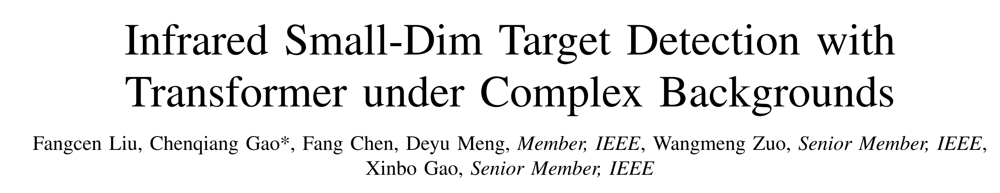
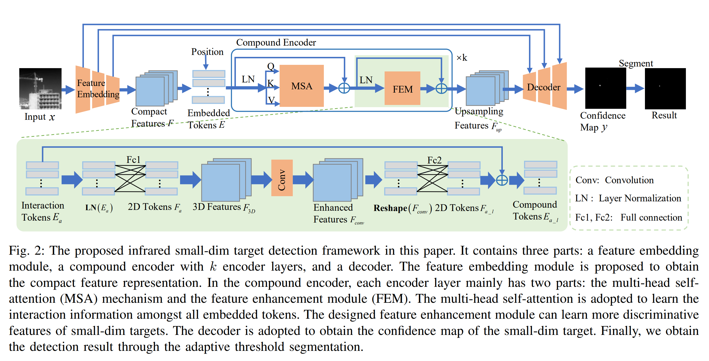

# infrared small-dim target detection with transformer under complex backgrounds

作者单位：重庆邮电大学 
论文下载链接：<https://arxiv.org/pdf/2109.14379.pdf> 

## 摘要
红外定位追踪系统中的一个关键技术是弱小红外目标检测。
但是现有的基于深度学习的方法受限于卷积神经网络的局部性，探索大范围依赖关系的能力不足。
除此之外，红外目标的表象信息不够清晰，使得模型很容易漏检或者错检。 
因此，提出一个鲁棒性高并且通用的基于transformer的红外弱小目标检测方法：
Transformer中的自注意力机制可以学习图像上的大范围特征；特征增强模块用来学习弱小目标的特征，来避免误判；解码器的结构中含有类似U-Net的跳远链接，可以包含更多小目标的信息；在这个方法的最后，用一个分割头得到检测结果。
应用在两个数据集上的实验结果证明，本方法跨场景的泛化性很好，并能够不受噪声干扰的影响。

## 相关工作
### 1. 小目标检测
#### 基于红外影像的小目标检测
基于模型：the low-rank-based infrared patch-image model (IPI); column weighted IPI model (WIPI); reweighed infrared patch-tensor model (RIPT). 缺点是泛化性一般。（个人觉得不重要，只要精度高，体量小，可以用于边缘设备更有意义） 
基于数据：TBC-Net by Zhao; GANs by Wang; 将小目标检测视为去噪任务 by Shi and Zhao; RISTDnet by Hou; 端对端网络 ALC & ACM by Dai. (主要应用CNN框架，然后采取一些手段克服CNN的缺点) 
#### 基于RGB图像的小目标检测
RGB图像上检测小目标，可以采用的策略有：数据增强、多尺度学习、上下文信息、最大池化。但是不能在红外影像上这样做，会使实验性能变差 by [Wang](https://openaccess.thecvf.com/content_ICCV_2019/papers/Wang_Miss_Detection_vs._False_Alarm_Adversarial_Learning_for_Small_Object_ICCV_2019_paper.pdf)。 
### 2. 将自注意力机制和CNN结合
Vision Transformer (ViT) -- 图像分类 
Swin transformer -- 分等级的transformer 
[ConViT](https://arxiv.org/pdf/2103.10697v2.pdf) -- gated positional self-attention 

## 本文方法

### A. 综述
整体框架由三个部分组成：（1）从原始数据中提取出简洁的特征，用Resnet-50；（2）用复合编码器从所有的token中学习出相互作用的信息，以及弱小目标的更具备分辨力的特征；（3）解码器生成置信图，用自适应阈值分割置信图，得到检测结果。 
（*token是指 image patch 做线性映射，并加上位置编码* ） 
### B. 特征提取模块
原始图像输入Resnet-50得到多张特征图，然后映射成一系列tokens。 
输入图像尺寸： 
特征图尺寸： 
线性映射后的tokens：, *n=H'W'* 是tokens的数量 
加入位置编码后的tokens：,&space;E\in\mathbb{R}^{n\times&space;C_1}) 
### C. 复合编码器
复合编码器由k个相同的编码块组成，这个编码块由m个头的多头自注意力（MSA）和特征增强模块（FEM）组成。
  - MSA：发掘目标和背景之间的不同之处。E被分为m份（heads），,&space;E^j\in\mathbb{R}^{n\times\frac{C_1}{m}})，然后输入MSA得到。 
  
