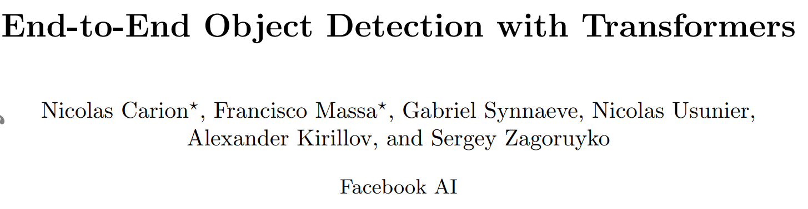

# End-to-End Object Detection with Transformers
 
作者单位：Facebook AI 
文章链接：[paper](https://arxiv.org/pdf/2005.12872v3.pdf), [code](https://github.com/facebookresearch/detr), [website](https://ai.facebook.com/blog/end-to-end-object-detection-with-transformers/) 
会议：ECCV2020 

## 摘要
本文解决目标检测的方法是集合预测，网络的输出就是最终的预测的集合，也不需要任何后处理。
集合预测简化了检测的流程，不需要NMS以及预设anchor。
新框架名为DETR（**DE**tection **TR**ansformer），其中的主要构成有：基于集合的全局损失；transformer的编码器-解码器结构。
当指定一组可学习的目标“查询-query”，DETR推理出目标和全局信息的关系，直接输出所有预测结果。
在COCO数据集上，DETR的精度和运行速度都与Faster R-CNN不相上下，并且可以扩展到全景分割的任务。

## 引言
现有的解决目标检测问题的方法都是间接的，依赖于大量的proposals、anchors、window centers。
因此检测结果的精度很大程度上依赖于后处理手段，去除冗余的检测框。
直接的集合预测方法可以简化目标检测任务的流程。 
Transformer的自注意力机制显式地模拟了一个序列中俩俩元素之间的关系，可以解决集合预测的一些特定约束条件，例如删除重复的预测框。 
DETR可以一次性预测出所有目标的位置，而且可以使用已有的标准深度学习库，不需要定制层，可以轻松复现。 
与之前的直接集合预测方法相比，DETR的主要特点是双向匹配的损失函数和并行解码的transformer。
前作重点放在用RNN的自回归解码。
DETR的损失函数是一对一的，一个预测结果对应一个真实结果，不会因为检测目标的排列不同而改变，因此可以并行处理。 
