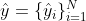

# End-to-End Object Detection with Transformers
 
作者单位：Facebook AI 
文章链接：[paper](https://arxiv.org/pdf/2005.12872v3.pdf), [code](https://github.com/facebookresearch/detr), [website](https://ai.facebook.com/blog/end-to-end-object-detection-with-transformers/) 
会议：ECCV2020 

## 摘要
本文解决目标检测的方法是集合预测，网络的输出就是最终的预测的集合，也不需要任何后处理。
集合预测简化了检测的流程，不需要NMS以及预设anchor。
新框架名为DETR（**DE**tection **TR**ansformer），其中的主要构成有：基于集合的全局损失；transformer的编码器-解码器结构。
当指定一组可学习的目标“查询-query”，DETR推理出目标和全局信息的关系，直接输出所有预测结果。
在COCO数据集上，DETR的精度和运行速度都与Faster R-CNN不相上下，并且可以扩展到全景分割的任务。

## 引言
现有的解决目标检测问题的方法都是间接的，依赖于大量的proposals、anchors、window centers。
因此检测结果的精度很大程度上依赖于后处理手段，去除冗余的检测框。
直接的集合预测方法可以简化目标检测任务的流程。 
Transformer的自注意力机制显式地模拟了一个序列中俩俩元素之间的关系，可以解决集合预测的一些特定约束条件，例如删除重复的预测框。 
DETR可以一次性预测出所有目标的位置，而且可以使用已有的标准深度学习库，不需要定制层，可以轻松复现。 
与之前的直接集合预测方法相比，DETR的主要特点是双向匹配的损失函数和并行解码的transformer。
前作重点放在用RNN的自回归解码。
DETR的损失函数是一对一的，一个预测结果对应一个真实结果，不会因为检测目标的排列不同而改变，因此可以并行处理。 
在COCO数据集上，DETR的检测效果可以与Faster R-CNN相媲美，而且在检测大目标时，有更好的检测结果，这可能是transformer的非局部计算带来的好处。
**但是，在做小目标检测时，DETR的效果不佳，希望后续工作可以加以改进，类似于FPN对Faster R-CNN的提升。**  
DETR在训练时，所需时间更长，而且在消融实验中，我们进一步探索了影响结果好坏的重要组成部分。

## 相关工作
### 1. 集合预测
目前没有权威的直接预测集合的深度学习模型。
最基础的集合预测任务是多标签分类任务，但是解决这个问题的基本思路（one-vs-rest）不适用于目标检测任务，例如几乎一摸一样的预测框，产生大量相似的预测结果。
集合预测不需要类似NMS的后处理步骤。
对于固定大小的集合预测，D-FCN可以解决但是消耗太大。
一个通用的方法是RNN，RNN是自回归序列模型。 
基于匈牙利算法（hungarian algorithm）的损失函数可以找到预测和真实结果之间的匹配（双向，一对一），有排列不变性。 
> 解决多分类问题的策略 
> **one-vs-rest** ：建立n个二项分类器。（A,非A）（B,非B）（C,非C） 
> **one-vs-one** ：建立k=n*(n-1)/2个二项分类器。(A,B) (A,C) (B,C) 
### 2. Transformers 和并行解码
Transformer的自注意力机制更新序列中一个元素的方法是：将整个序列的信息综合进去。
结合transformer和并行计算，可以权衡集合预测的全局计算和计算复杂度之间的。
### 3. 目标检测
大部分目标检测方法基于初始猜测做预测。
两阶段检测器用proposal预测检测框，单阶段用anchors或潜在的目标中心点组成的网格，并且最近的研究表明，检测效果好坏与这些初始设置密切相关。
DETR不需要这些手工设计的阶段，将检测流程简化为基于图像本身检测目标。 
**基于集合的损失函数：**
一些检测器也用到了双向匹配损失（例如SSD），但是这些检测器仅用卷积层或全连接层模拟不同预测之间的关系，然后用NMS来提升检测结果精读。 
**recurrent detector（maybe 基于rnn的检测器） ：** 
与detr相近的方法有实例分割和目标检测任务中的：[Recurrent Instance Segmentation-2015](https://www.robots.ox.ac.uk/~tvg/publications/2016/RIS7.pdf), [End-to-End Instance Segmentation with Recurrent Attention-2017](https://arxiv.org/pdf/1605.09410v5.pdf), [End-to-end people detection in crowded
scenes-2015](https://arxiv.org/pdf/1506.04878v3.pdf)。
他们也都使用了双向损失函数和编码解码结构，但这些方法只在小规模数据集上做了实验，并且是基于自回归模型RNN，因此效果不如有并行解码的transformer。

## DETR
模型中最重要的两点：
  - 预测结果和GT之间的一一对应的损失函数；
  - 可以预测目标位置和目标之间关系的模型。
### A. Objection detecyion set prediction loss
N: predictions的数量，远大于一张图像中的目标数目 
y: ground truth set of objects, 但是为了实现prediction和GT之间一一对应的关系，用空集把y补齐N个 
: the set of N predictions 
**如何定义一一对应的匹配关系**：
找到一个让损失函数最小的排列(permutation)。 

>  可以看作是N个predictions的所有排列可能中的一个。 

式子中的 考量了两个方面：1. 类别是否预测对了；2. 预测的框和GT的框的相似程度。 
接下来，问题是**如何计算式子中的匹配损失函数**： 
 
在实际操作中，为了解决**类别不均衡**的问题，当类别为空集时，将对数概率项缩小1/10。 
所使用的匹配损失函数与原本的匈牙利算法不同的一点是：作者使用了probability而不是log-probability，其作用是使得分类损失和检测框损失可以在同一单位读量。 
#### Bounding box loss 
使用了l1损失和广义IoU损失的线性组合，因为IoU损失不受尺度影响。 
 
### B. DETR架构
 
DETR由三部分组成：1.提取特征图的CNN骨干网络；2. 编码器-译码器Transformer；3. 输出最后检测结果的前馈网络（FFN）。 
#### a) 骨干网络
输入大小： 
输出大小： 
具体取值： 
#### b) 编码器
1. 用1x1卷积把特征图f降维： ，d是通道维度，HxW是空间维度。 
2. 编码器的输入需要序列：把z_0的空间维度“降维”到1，此时的特征图大小是dxHW。 
3. 每个编码器层（块）由多头自注意力模块、FFN组成。 
4. 每个注意力层的输入都加入了不变的位置编码。 
#### c) 解码器
解码器tansform N个d维的embeddings。
与原版的区别是，本文中的每层解码器都并行地解码N个目标，但是原版采用的是自回归模型，每次预测一个输出序列的元素。
因为解码器的结果与排列无关，因此N个输入的embeddings必须两两不同。
> **如何理解embeddings：** decoder的输入(object query)和输出。是长度为d的向量。
> 可视化后，可以理解成“着重关注某个位置或者某个特征（e.g.目标的size）的眼睛”。

N个object queries ---解码器---> 输出embedding ---用N个FFN解码，互不影响---> 检测框坐标+类别=N个检测结果。
#### d) 预测前馈网络
最后的预测前馈网络的构成是：3层感知器（ReLU激活函数，隐藏层维度为d），一个线性映射层。
FFN基于输入图像预测检测框的中心点坐标、宽和高；线性层用softmax函数预测类别。
#### e) 补充的解码损失函数
在训练解码器的过程中，使用auxiliary loss有用，能够帮助模型输出的检测结果个数正确。
每个解码器层后面都加了预测前馈网络和匈牙利损失函数，而且所有FFNs共享参数。

## 实验
#### 数据集
COCO 2017: 118K张训练图像，5K张验证图像。训练集中，一张图像上最多有63个大小不同的检测目标。 
#### 实现细节
训练使用[AdamW](https://arxiv.org/abs/1711.05101v3)，初始的transformer学习率设置为1e-4，骨干网络额学习率为1e-5，权值衰减（weight decay）设为1e-4。 
所有transformer的权重都用[Xavier初始化方法](https://blog.csdn.net/victoriaw/article/details/73000632)。 
DETR -- ResNet-50; DETR-R101 -- ResNet-101; DETR-DC5 -- add a dilation && remove a stride. 
默认的dropout：0.1  
scale augmentation 
crop augmentation 

### A. 对比试验 Faster R-CNN
### B. 消融实验
### C. 分析

## 结论
